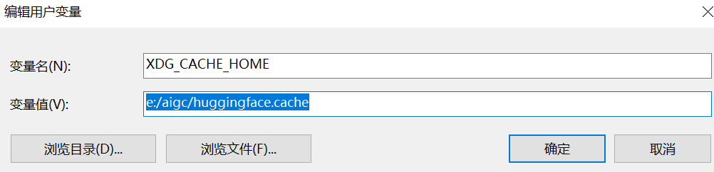
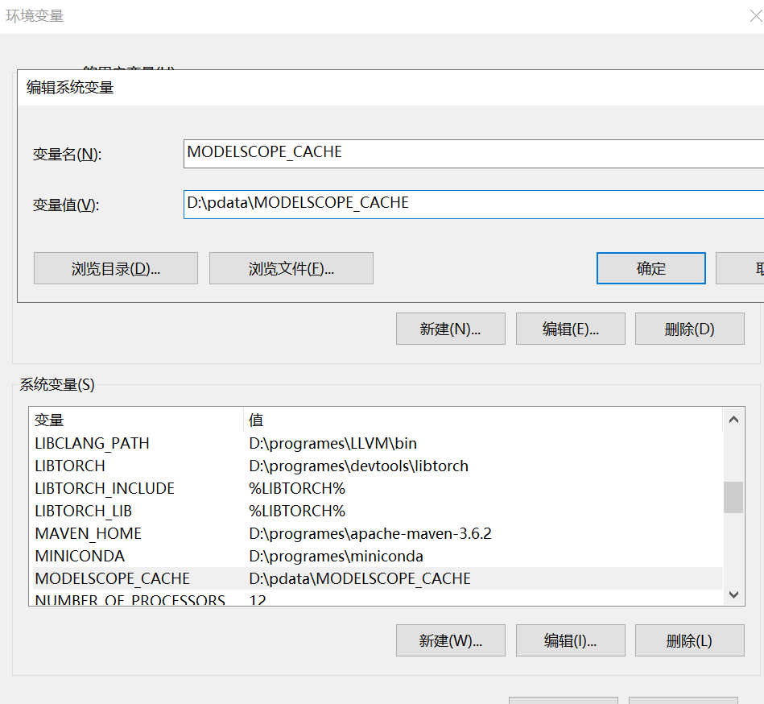

# 1.0  AI小助手开发之conda

## 面向人群

- 有python基础
- 对AI感兴趣
- 有动手能力
- 有电脑

## 基础

- git，及常用命令clone/add/commit/push/fetch/pull，而且在windows平台上，git-bash是很好的bash环境
- vscode/pycharm
- 科学上网  github/huggingface，无法科学上网，就使用国内代理
  - github国内可访问，网络不好，使用：https://mirror.ghproxy.com/
  - huggingface国内代理： https://hf-mirror.com


## conda安装

  conda是python环境的包管理器，常用的包括`anaconda`/`miniconda`/`miniforge`等，因`miniforge`是全开源的软件，推荐使用`miniforge`

### 下载地址

[https://github.com/conda-forge/miniforge](https://github.com/conda-forge/miniforge)，国内可以使用清华源下载后安装，[https://mirrors.tuna.tsinghua.edu.cn/github-release/conda-forge/miniforge/LatestRelease/](https://mirrors.tuna.tsinghua.edu.cn/github-release/conda-forge/miniforge/)


### 安装注意事项

- 安装目前必须是全英文
- 安装目录最好不要有空格等特殊字符
- 最好不要安装在系统盘
- 安装后，可能需要重新启动命令行等

## 安装过程

- 按`下一步`进行安装，可以修改安装目录
- 安装完成后，默认的python环境安装目录在`C:\Users\{用户名}\.conda\envs下边`，具体可以通过`conda config --show`查看`envs_dirs`来确认，执行命令`conda create -n demo python=3.10 -y`，确认安装目录在哪
- 修改`envs_dirs`的目录，执行命令`conda config --add envs_dirs {新的envs目录}`来设置默认的目录

## conda常用命令

- 查询当前系统可用环境：`conda env list`
- 创建新环境： `conda create -n 环境名称 python=3.9 -y`
- 激活环境： `conda activate 环境名称`
- 退出环境： `conda deactivate`
- 删除环境： `conda remove -n 环境名称 --all`
- 需要强制指定安装目录：`conda create --prefix={自定义目录} python=3.10 -y`，这样，启动时，也必须指定完整目录地址


## 环境变量

    在系统运行时，会有很多的cache，像python通过pip安装library时，使用huggingface库，modelscope都会有缓存，而且默认是在c盘，随着时间推移，导致c盘空间占用越来越大

- pip cache的配置

```bash
pip config set global.cache-dir "自定义目录"
```

- huggingface的cache配置

  设置环境变量`XDG_CACHE_HOME`为自定义目录



- huggingface代理配置

  针对huggingface无法访问，可以设置全局或临时环境变量，`set HF_ENDPOINT=https://hf-mirror.com`, linux下每次执行代码前执行`export HF_ENDPOINT=https://hf-mirror.com`

- modelscope的cache配置

  设置环境变量`MODELSCOPE_CACHE`为自定义目录

