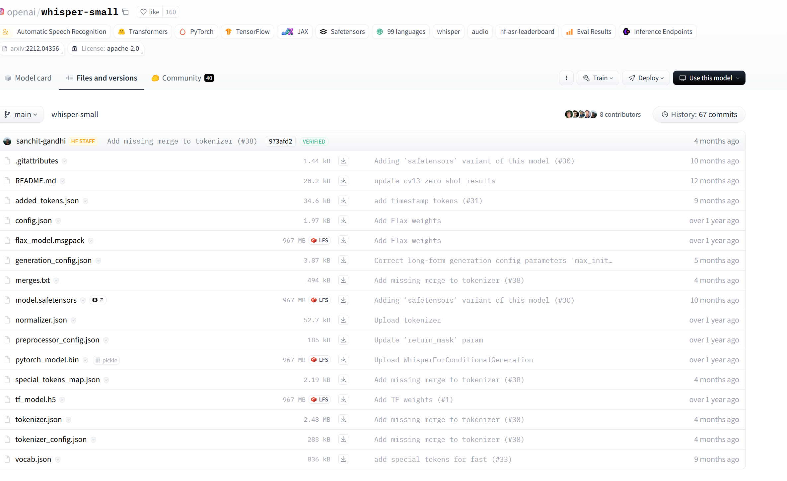

# 2.0 AI小助手开发之ASR模块

   ASR全称`Automic Speech Recognization`，自动语音识别，实现语音转文字功能。目前也是有很多不输商业的开源项目，如whisper\paraformer\kaldi等。

## whisper

    由openai开发并开源的语音识别模型，包括多种参数量，可以根据自身的设备情况来选择使用哪种大小的模型

|Size|Parameters|English-only model	|Multilingual model|	Required VRAM|	Relative speed
|:---|:---|:---|:---|:---|:---|
tiny|39 M|	tiny.en	|tiny	|~1 GB|	~32x
base|74 M	|base.en	|base	|~1 GB	|~16x
small	|244 M	|small.en	|small	|~2 GB	|~6x
medium	|769 M	|medium.en	|medium	|~5 GB	|~2x
large	|1550 M|	N/A	|large	|~10 GB	|1x

- 源码：https://github.com/openai/whisper
- 模型：
  - https://huggingface.co/openai/whisper-tiny
  - https://huggingface.co/openai/whisper-base
  - https://huggingface.co/openai/whisper-small
  - https://huggingface.co/openai/whisper-medium
  - https://huggingface.co/openai/whisper-large

### whisper.cpp与faster-whisper

    whisper执行效率不够高，所以有人开发了[whisper.cpp](https://github.com/ggerganov/whisper.cpp)和[faster-whisper](https://github.com/SYSTRAN/faster-whisper)，其中`faster-whisper`在执行效率、内存占用等方面比较有优势。`whisper-cpp`可以很方便的集成到c++以及可以与c++结合的项目里边，支持的平台像android\ios\wams\树莓派等平台。

faster-whisper平台上的性能比较

### Large-v2 model on GPU

| Implementation | Precision | Beam size | Time | Max. GPU memory | Max. CPU memory |
| --- | --- | --- | --- | --- | --- |
| openai/whisper | fp16 | 5 | 4m30s | 11325MB | 9439MB |
| faster-whisper | fp16 | 5 | 54s | 4755MB | 3244MB |
| faster-whisper | int8 | 5 | 59s | 3091MB | 3117MB |

*Executed with CUDA 11.7.1 on a NVIDIA Tesla V100S.*

### Small model on CPU

| Implementation | Precision | Beam size | Time | Max. memory |
| --- | --- | --- | --- | --- |
| openai/whisper | fp32 | 5 | 10m31s | 3101MB |
| whisper.cpp | fp32 | 5 | 17m42s | 1581MB |
| whisper.cpp | fp16 | 5 | 12m39s | 873MB |
| faster-whisper | fp32 | 5 | 2m44s | 1675MB |
| faster-whisper | int8 | 5 | 2m04s | 995MB |

*Executed with 8 threads on a Intel(R) Xeon(R) Gold 6226R.*

### Distil-whisper

| Implementation | Precision | Beam size | Time | Gigaspeech WER |
| --- | --- | --- | --- | --- |
| distil-whisper/distil-large-v2 | fp16 | 4 |- | 10.36 |
| [faster-distil-large-v2](https://huggingface.co/Systran/faster-distil-whisper-large-v2) | fp16 | 5 | - | 10.28 |
| distil-whisper/distil-medium.en | fp16 | 4 | - | 11.21 |
| [faster-distil-medium.en](https://huggingface.co/Systran/faster-distil-whisper-medium.en) | fp16 | 5 | - | 11.21 |

### 模型下载

- whisper.cpp下载地址： https://huggingface.co/ggerganov/whisper.cpp/tree/main
- fater-whisper下载： https://huggingface.co/Systran
  - https://huggingface.co/Systran/faster-whisper-small
  - https://huggingface.co/Systran/faster-whisper-base
  - https://huggingface.co/Systran/faster-whisper-medium
  - https://huggingface.co/Systran/faster-whisper-large-v2
  - https://huggingface.co/Systran/faster-distil-whisper-large-v3/tree/main

### 示例代码

基于faster-whisper的示例代码，根据给定的音频进行语音识别，获取结果。

[2.0_ASR_whisper/main.py](./2.0_ASR_whisper/main.py)

## paramformer及funasr

    [paramformer](https://github.com/modelscope/FunASR/wiki/paraformer)由阿里巴巴达摩院出品，在中文识别上比whisper要好，目前已经发布了多个版本，模型主要发布在modelscope.cn上
    [funasr](https://github.com/modelscope/FunASR)由阿里巴巴达摩院开发，是一个基础语音识别工具包，提供多种功能，包括语音识别（ASR）、语音端点检测（VAD）、标点恢复、语言模型、说话人验证、说话人分离和多人对话语音识别等。FunASR提供了便捷的脚本和教程，支持预训练好的模型的推理与微调。

- 源码：[https://github.com/modelscope/FunASR/](https://github.com/modelscope/FunASR/)

### 示例代码

[2.1_ASR_funasr/main.py](./2.1_ASR_funasr/main.py)

## kaldi

https://github.com/k2-fsa/sherpa-onnx

## fastasr

  源码地址：[https://github.com/chenkui164/FastASR](https://github.com/chenkui164/FastASR)

  这是一个用C++实现ASR推理的项目，推理效率高，资源占用少，只是实现了推理和模型转换，使用的模型也是其它的开源模型，如paraformer等

### 示例代码

[2.2_ASR_fastasr/main.py](./2.2_ASR_fastasr/main.py)